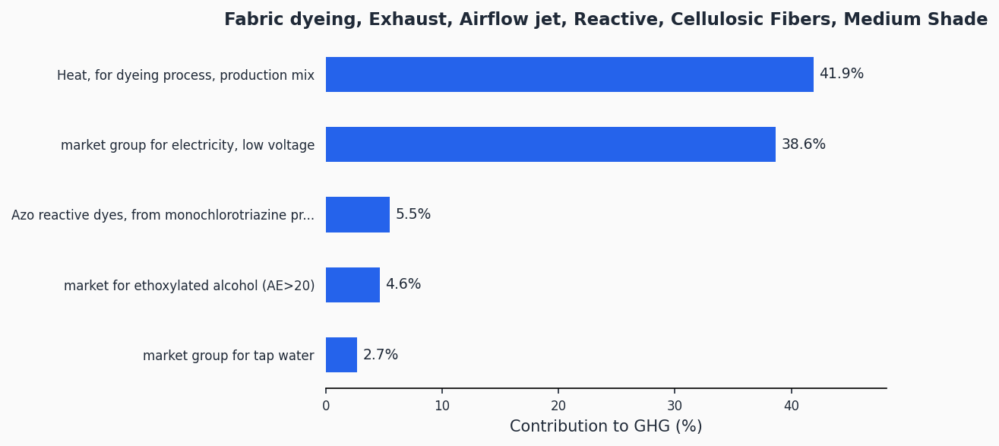
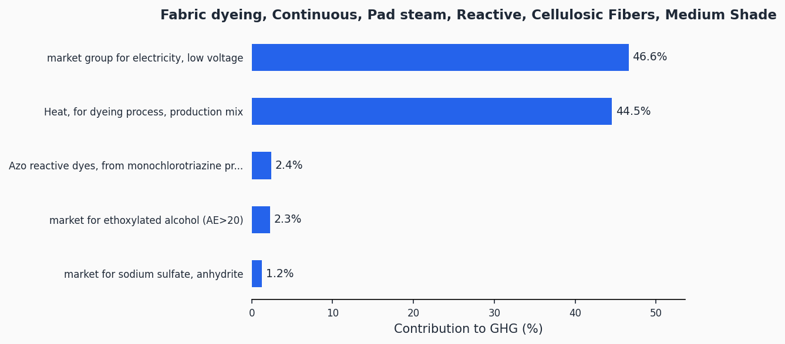
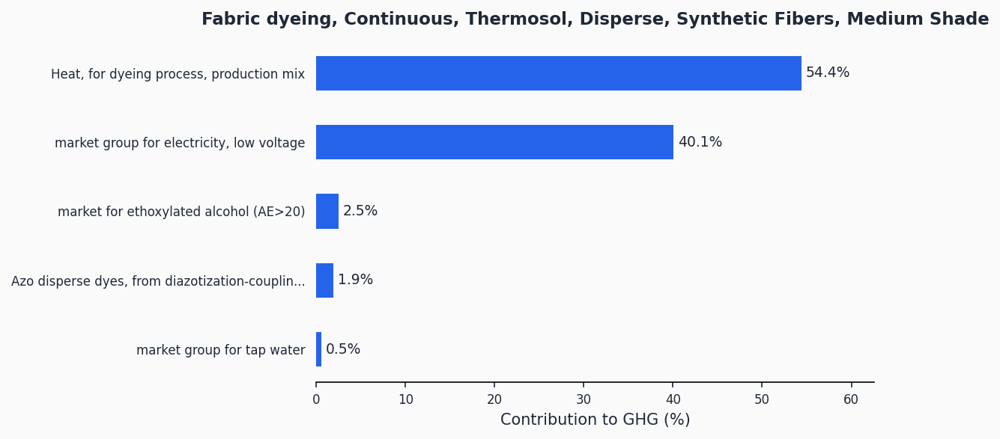
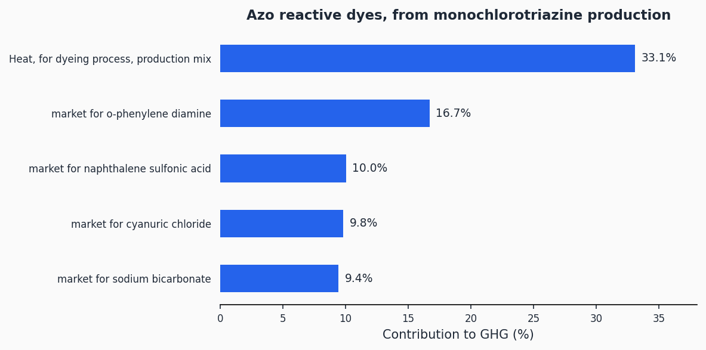

# Dyeing

> Lifecycle assessment datasets for textile dyeing across exhaust, continuous, pad steam, and thermosol processes for multiple dye classes and fibre types.

**38 datasets** | Functional unit: 1 kg dyed textile | All 16 EF 3.1 impact indicators

## Overview

This process category covers fabric dyeing — the application of colour to textile substrates. The system boundary includes energy (electricity and thermal), auxiliary chemicals, dyestuffs, water consumption, and wastewater treatment. Datasets span four main dyeing technologies (exhaust, continuous pad steam, continuous thermosol) across multiple dye-fibre combinations (reactive on cellulosic, disperse on synthetic, acid on animal fibres, vat on cellulosic), plus dye production inventories.

## Datasets

| Descriptor | Activity | GHG (kgCO2eq/kg) |
|------------|----------|------------------:|
| `MATERIAL_PROCESS_STEP:COLORATION/DYEING/FABRIC/ACID/CONTINUOUS/PAD_STEAM#WOOL_AND_SILK@WORLD` | Fabric dyeing, Continuous, Pad steam, Acid, Animal Fibers, Medium Shade | 3.29 |
| `MATERIAL_PROCESS_STEP:COLORATION/DYEING/FABRIC/REACTIVE/CONTINUOUS/PAD_STEAM#NATURAL_FIBERS@WORLD` | Fabric dyeing, Continuous, Pad steam, Reactive, Cellulosic Fibers, Medium Shade | 3.39 |
| `MATERIAL_PROCESS_STEP:COLORATION/DYEING/FABRIC/VAT/CONTINUOUS/PAD_STEAM#NATURAL_FIBERS@WORLD` | Fabric dyeing, Continuous, Pad steam, Vat, Cellulosic Fibers, Medium Shade | 3.63 |
| `MATERIAL_PROCESS_STEP:COLORATION/DYEING/FABRIC/DISPERSE/CONTINUOUS/THERMOSOL#SYNTHETIC_FIBERS@WORLD` | Fabric dyeing, Continuous, Thermosol, Disperse, Synthetic Fibers, Medium Shade | 3.09 |
| `MATERIAL_PROCESS_STEP:COLORATION/DYEING/FABRIC/ACID/BATCH/AIRFLOW_JET#WOOL_AND_SILK@WORLD` | Fabric dyeing, Exhaust, Airflow jet, Acid, Animal Fibers, Medium Shade | 3.26 |
| `MATERIAL_PROCESS_STEP:COLORATION/DYEING/FABRIC/ACID/BATCH/AIRFLOW_JET#SYNTHETIC_FIBERS@WORLD` | Fabric dyeing, Exhaust, Airflow jet, Acid, Synthetic Fibers, Medium Shade | 2.04 |
| `MATERIAL_PROCESS_STEP:COLORATION/DYEING/FABRIC/DISPERSE/BATCH/AIRFLOW_JET#SYNTHETIC_FIBERS@WORLD` | Fabric dyeing, Exhaust, Airflow jet, Disperse, Synthetic Fibers, Medium Shade | 2.34 |
| `MATERIAL_PROCESS_STEP:COLORATION/DYEING/FABRIC/REACTIVE/BATCH/AIRFLOW_JET#NATURAL_FIBERS@WORLD` | Fabric dyeing, Exhaust, Airflow jet, Reactive, Cellulosic Fibers, Medium Shade | 2.49 |
| `MATERIAL_PROCESS_STEP:COLORATION/DYEING/FABRIC/ACID/BATCH/BEAM#WOOL_AND_SILK@WORLD` | Fabric dyeing, Exhaust, Beam, Acid, Animal Fibers, Medium Shade | 5.00 |
| `MATERIAL_PROCESS_STEP:COLORATION/DYEING/FABRIC/ACID/BATCH/BEAM#SYNTHETIC_FIBERS@WORLD` | Fabric dyeing, Exhaust, Beam, Acid, Synthetic Fibers, Medium Shade | 3.21 |
| `MATERIAL_PROCESS_STEP:COLORATION/DYEING/FABRIC/DISPERSE/BATCH/BEAM#SYNTHETIC_FIBERS@WORLD` | Fabric dyeing, Exhaust, Beam, Disperse, Synthetic Fibers, Medium Shade | 4.08 |
| `MATERIAL_PROCESS_STEP:COLORATION/DYEING/FABRIC/REACTIVE/BATCH/BEAM#NATURAL_FIBERS@WORLD` | Fabric dyeing, Exhaust, Beam, Reactive, Cellulosic Fibers, Medium Shade | 4.07 |
| `MATERIAL_PROCESS_STEP:COLORATION/DYEING/FABRIC/ACID/BATCH/CONVENTIONAL_JET#WOOL_AND_SILK@WORLD` | Fabric dyeing, Exhaust, Conventional jet, Acid, Animal Fibers, Medium Shade | 6.79 |
| `MATERIAL_PROCESS_STEP:COLORATION/DYEING/FABRIC/ACID/BATCH/CONVENTIONAL_JET#SYNTHETIC_FIBERS@WORLD` | Fabric dyeing, Exhaust, Conventional jet, Acid, Synthetic Fibers, Medium Shade | 4.33 |
| `MATERIAL_PROCESS_STEP:COLORATION/DYEING/FABRIC/DISPERSE/BATCH/CONVENTIONAL_JET#SYNTHETIC_FIBERS@WORLD` | Fabric dyeing, Exhaust, Conventional jet, Disperse, Synthetic Fibers, Medium Shade | 4.76 |
| `MATERIAL_PROCESS_STEP:COLORATION/DYEING/FABRIC/REACTIVE/BATCH/CONVENTIONAL_JET#NATURAL_FIBERS@WORLD` | Fabric dyeing, Exhaust, Conventional jet, Reactive, Cellulosic Fibers, Medium Shade | 5.54 |
| `MATERIAL_PROCESS_STEP:COLORATION/DYEING/FABRIC/ACID/BATCH/SOFTFLOW_JET#WOOL_AND_SILK@WORLD` | Fabric dyeing, Exhaust, Softflow jet, Acid, Animal Fibers, Medium Shade | 4.68 |
| `MATERIAL_PROCESS_STEP:COLORATION/DYEING/FABRIC/ACID/BATCH/SOFTFLOW_JET#SYNTHETIC_FIBERS@WORLD` | Fabric dyeing, Exhaust, Softflow jet, Acid, Synthetic Fibers, Medium Shade | 3.18 |
| `MATERIAL_PROCESS_STEP:COLORATION/DYEING/FABRIC/DISPERSE/BATCH/SOFTFLOW_JET#SYNTHETIC_FIBERS@WORLD` | Fabric dyeing, Exhaust, Softflow jet, Disperse, Synthetic Fibers, Medium Shade | 3.44 |
| `MATERIAL_PROCESS_STEP:COLORATION/DYEING/FABRIC/REACTIVE/BATCH/SOFTFLOW_JET#NATURAL_FIBERS@WORLD` | Fabric dyeing, Exhaust, Softflow jet, Reactive, Cellulosic Fibers, Medium Shade | 3.98 |
| `MATERIAL_PROCESS_STEP:COLORATION/DYEING/FABRIC/REACTIVE/SEMI-CONTINUOUS/CPB#NATURAL_FIBERS@WORLD` | Fabric dyeing, Semi-continuous, CPB, Reactive, Cellulosic Fibers, Medium Shade | 2.81 |
| `MATERIAL_PROCESS_STEP:COLORATION/DYEING/FIBER/ACID/BATCH/PACKAGE#WOOL_AND_SILK@WORLD` | Fiber dyeing, Exhaust, Package, Acid, Animal Fibers, Medium Shade | 4.14 |
| `MATERIAL_PROCESS_STEP:COLORATION/DYEING/FIBER/ACID/BATCH/PACKAGE#SYNTHETIC_FIBERS@WORLD` | Fiber dyeing, Exhaust, Package, Acid, Synthetic Fibers, Medium Shade | 3.58 |
| `MATERIAL_PROCESS_STEP:COLORATION/DYEING/FIBER/DISPERSE/BATCH/PACKAGE#SYNTHETIC_FIBERS@WORLD` | Fiber dyeing, Exhaust, Package, Disperse, Synthetic Fibers, Medium Shade | 4.19 |
| `MATERIAL_PROCESS_STEP:COLORATION/DYEING/FIBER/REACTIVE/BATCH/PACKAGE#NATURAL_FIBERS@WORLD` | Fiber dyeing, Exhaust, Package, Reactive, Cellulosic Fibers, Medium Shade | 3.97 |
| `MATERIAL_PROCESS_STEP:COLORATION/DYEING/FIBER/VAT/BATCH/PACKAGE#NATURAL_FIBERS@WORLD` | Fiber dyeing, Exhaust, Package, Vat, Cellulosic Fibers, Medium Shade | 4.01 |
| `MATERIAL_PROCESS_STEP:COLORATION/DYEING/GARMENT/REACTIVE/BATCH/FRONT_LOADER#NATURAL_FIBERS@WORLD` | Garment dyeing, Exhaust, Front Loader, Reactive, Cellulosic Fibers, Medium Shade | 4.45 |
| `MATERIAL_PROCESS_STEP:COLORATION/DYEING/YARN/INDIGO/CONTINUOUS/ROPE#NATURAL_FIBERS@WORLD` | Yarn dyeing, Continuous, Rope, Indigo, Cellulosic Fibers, Medium Shade | 7.89 |
| `MATERIAL_PROCESS_STEP:COLORATION/DYEING/YARN/ACID/BATCH/HANK#WOOL_AND_SILK@WORLD` | Yarn dyeing, Exhaust, Hank, Acid, Animal Fibers, Medium Shade | 6.72 |
| `MATERIAL_PROCESS_STEP:COLORATION/DYEING/YARN/ACID/BATCH/HANK#SYNTHETIC_FIBERS@WORLD` | Yarn dyeing, Exhaust, Hank, Acid, Synthetic Fibers, Medium Shade | 3.98 |
| `MATERIAL_PROCESS_STEP:COLORATION/DYEING/YARN/DISPERSE/BATCH/HANK#SYNTHETIC_FIBERS@WORLD` | Yarn dyeing, Exhaust, Hank, Disperse, Synthetic Fibers, Medium Shade | 4.85 |
| `MATERIAL_PROCESS_STEP:COLORATION/DYEING/YARN/REACTIVE/BATCH/HANK#NATURAL_FIBERS@WORLD` | Yarn dyeing, Exhaust, Hank, Reactive, Cellulosic Fibers, Medium Shade | 5.75 |
| `MATERIAL_PROCESS_STEP:COLORATION/DYEING/YARN/VAT/BATCH/HANK#NATURAL_FIBERS@WORLD` | Yarn dyeing, Exhaust, Hank, Vat, Cellulosic Fibers, Medium Shade | 8.48 |
| `MATERIAL_PROCESS_STEP:COLORATION/DYEING/YARN/ACID/BATCH/PACKAGE#WOOL_AND_SILK@WORLD` | Yarn dyeing, Exhaust, Package, Acid, Animal Fibers, Medium Shade | 4.18 |
| `MATERIAL_PROCESS_STEP:COLORATION/DYEING/YARN/ACID/BATCH/PACKAGE#SYNTHETIC_FIBERS@WORLD` | Yarn dyeing, Exhaust, Package, Acid, Synthetic Fibers, Medium Shade | 3.67 |
| `MATERIAL_PROCESS_STEP:COLORATION/DYEING/YARN/DISPERSE/BATCH/PACKAGE#SYNTHETIC_FIBERS@WORLD` | Yarn dyeing, Exhaust, Package, Disperse, Synthetic Fibers, Medium Shade | 3.82 |
| `MATERIAL_PROCESS_STEP:COLORATION/DYEING/YARN/REACTIVE/BATCH/PACKAGE#NATURAL_FIBERS@WORLD` | Yarn dyeing, Exhaust, Package, Reactive, Cellulosic Fibers, Medium Shade | 5.19 |
| `MATERIAL_PROCESS_STEP:COLORATION/DYEING/YARN/VAT/BATCH/PACKAGE#NATURAL_FIBERS@WORLD` | Yarn dyeing, Exhaust, Package, Vat, Cellulosic Fibers, Medium Shade | 5.11 |

> Full results across all 16 EF 3.1 impact indicators: [impact-scores.csv](impact-scores.csv)

## GHG Contribution Analysis

Representative charts showing top GHG contributors. All charts available in the [charts/](charts/) folder.

### Fabric Dyeing Exhaust Airflow Jet Reactive Cellulosic Fibers Medium Shade

### Fabric Dyeing Continuous Pad Steam Reactive Cellulosic Fibers Medium Shade

### Fabric Dyeing Continuous Thermosol Disperse Synthetic Fibers Medium Shade

### Azo Reactive Dyes From Monochlorotriazine Production

> All 43 contribution charts: [charts/](charts/)

## Methodology

The datasets model electricity, thermal energy, auxiliary chemicals (24 specialty chemical categories), dyestuff production, water consumption, and wastewater treatment. Background data comes from ecoinvent 3.12 (Cut-Off system model) and impact assessment uses the EF 3.1 characterisation method.

Detailed methodology documentation: [methodology/](methodology/)

## Data Files

| File | Description |
|------|-------------|
| [impact-scores.csv](impact-scores.csv) | LCIA results for 16 EF 3.1 indicators + DQR scores |
| [ghg-contributions.csv](ghg-contributions.csv) | Per-exchange GHG contribution analysis |
| [process-steps.json](process-steps.json) | Machine-readable emission factor format |
| [inventory-brightway.xlsx](inventory-brightway.xlsx) | Brightway/Activity Browser compatible inventory |
