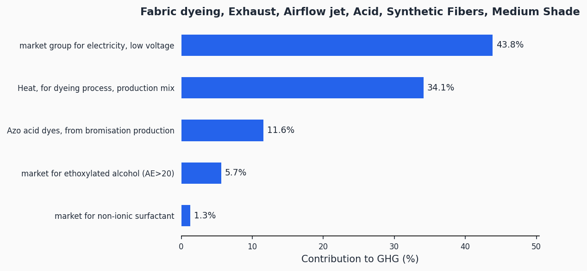
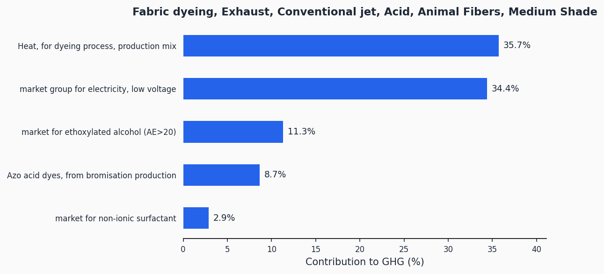
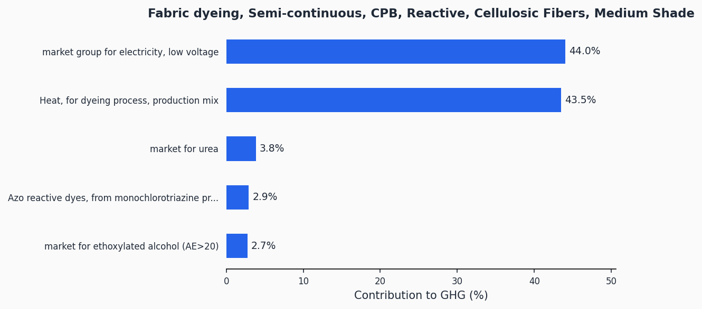
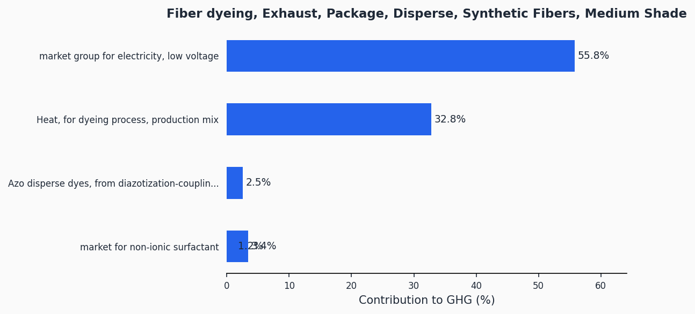
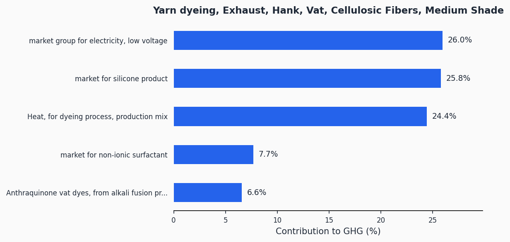
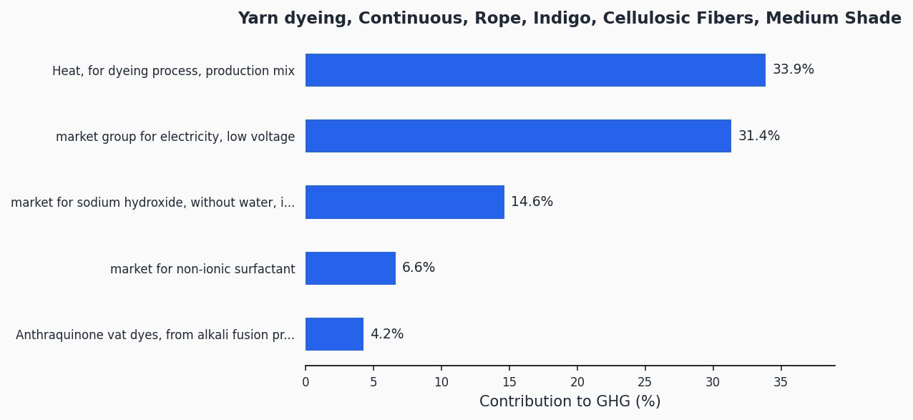
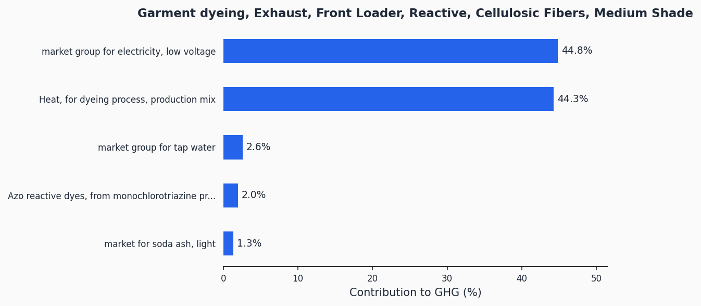
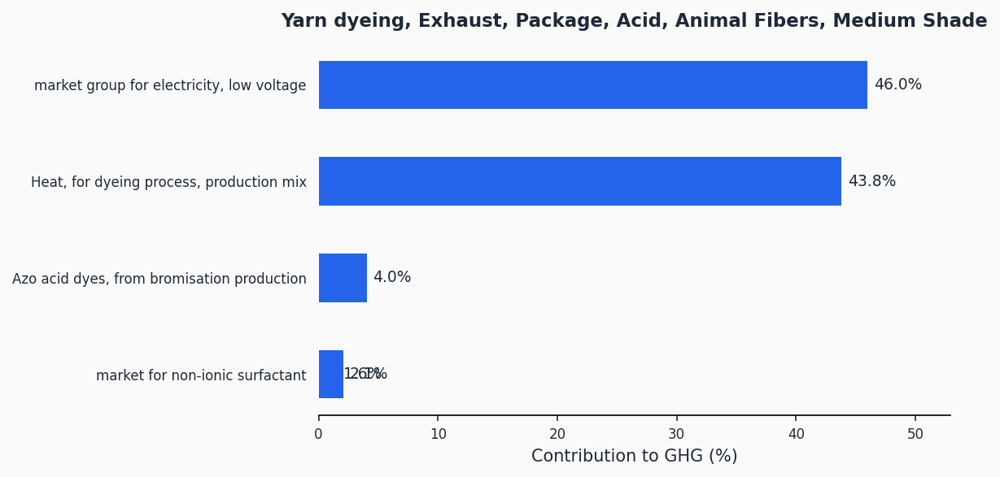

# Dyeing

> Lifecycle assessment datasets for textile coloration by dyeing across exhaust, continuous, and semi-continuous techniques for synthetic, animal, and cellulosic fibers.

**38 datasets** | Functional unit: 1 kg dyed textile | All 16 EF 3.1 impact indicators

## Overview

This process category covers dyeing -- the application of colorants to textile substrates (fiber, yarn, fabric, or garment) to achieve uniform coloration. Dyeing is one of the most resource-intensive steps in textile manufacturing, consuming significant quantities of water, energy, and chemicals. The system boundary includes heat and electricity inputs, dyestuff production, auxiliary chemicals, water consumption, and wastewater treatment.

The datasets span a wide matrix of dyeing configurations defined by three dimensions: **substrate** (fiber, yarn, fabric, garment), **application method** (exhaust batch processes and continuous/semi-continuous processes), and **dye class** (acid, disperse, reactive, vat, indigo). Each combination is further differentiated by **fiber type** (synthetic fibers, animal fibers/wool and silk, cellulosic fibers) and **equipment type** (package, hank, beam, softflow jet, conventional jet, airflow jet, jig, front loader, pad steam, thermosol, CPB, rope). All datasets represent a medium shade depth.

GHG impacts range from 2.04 kgCO2eq/kg (airflow jet, acid, synthetic) to 8.48 kgCO2eq/kg (hank dyeing, vat, cellulosic). The key impact drivers vary by technology: electricity dominates exhaust batch processes (due to liquor circulation and heating), while heat energy and dye chemicals are the main contributors in continuous processes. Wastewater volumes also contribute meaningfully, especially for high-liquor-ratio exhaust equipment.

## Impact Scores (GHG)

| Dataset | GHG (kgCO2eq/kg) |
|---------|-------------------|
| Fabric dyeing, Exhaust, Airflow jet, Acid, Synthetic Fibers, Medium Shade | 2.04 |
| Fabric dyeing, Exhaust, Airflow jet, Disperse, Synthetic Fibers, Medium Shade | 2.34 |
| Fabric dyeing, Exhaust, Airflow jet, Reactive, Cellulosic Fibers, Medium Shade | 2.49 |
| Fabric dyeing, Semi-continuous, CPB, Reactive, Cellulosic Fibers, Medium Shade | 2.81 |
| Fabric dyeing, Continuous, Thermosol, Disperse, Synthetic Fibers, Medium Shade | 3.09 |
| Fabric dyeing, Exhaust, Softflow jet, Acid, Synthetic Fibers, Medium Shade | 3.18 |
| Fabric dyeing, Exhaust, Beam, Acid, Synthetic Fibers, Medium Shade | 3.21 |
| Fabric dyeing, Exhaust, Airflow jet, Acid, Animal Fibers, Medium Shade | 3.26 |
| Fabric dyeing, Continuous, Pad steam, Acid, Animal Fibers, Medium Shade | 3.29 |
| Fabric dyeing, Continuous, Pad steam, Reactive, Cellulosic Fibers, Medium Shade | 3.39 |
| Fabric dyeing, Exhaust, Softflow jet, Disperse, Synthetic Fibers, Medium Shade | 3.44 |
| Fiber dyeing, Exhaust, Package, Acid, Synthetic Fibers, Medium Shade | 3.58 |
| Fabric dyeing, Continuous, Pad steam, Vat, Cellulosic Fibers, Medium Shade | 3.63 |
| Yarn dyeing, Exhaust, Package, Acid, Synthetic Fibers, Medium Shade | 3.67 |
| Yarn dyeing, Exhaust, Package, Disperse, Synthetic Fibers, Medium Shade | 3.82 |
| Fabric dyeing, Exhaust, Softflow jet, Reactive, Cellulosic Fibers, Medium Shade | 3.98 |
| Fiber dyeing, Exhaust, Package, Reactive, Cellulosic Fibers, Medium Shade | 3.97 |
| Yarn dyeing, Exhaust, Hank, Acid, Synthetic Fibers, Medium Shade | 3.98 |
| Fiber dyeing, Exhaust, Package, Vat, Cellulosic Fibers, Medium Shade | 4.01 |
| Fabric dyeing, Exhaust, Beam, Reactive, Cellulosic Fibers, Medium Shade | 4.07 |
| Fabric dyeing, Exhaust, Beam, Disperse, Synthetic Fibers, Medium Shade | 4.08 |
| Fiber dyeing, Exhaust, Package, Acid, Animal Fibers, Medium Shade | 4.14 |
| Yarn dyeing, Exhaust, Package, Acid, Animal Fibers, Medium Shade | 4.18 |
| Fiber dyeing, Exhaust, Package, Disperse, Synthetic Fibers, Medium Shade | 4.19 |
| Fabric dyeing, Exhaust, Conventional jet, Acid, Synthetic Fibers, Medium Shade | 4.33 |
| Garment dyeing, Exhaust, Front Loader, Reactive, Cellulosic Fibers, Medium Shade | 4.45 |
| Fabric dyeing, Exhaust, Softflow jet, Acid, Animal Fibers, Medium Shade | 4.68 |
| Fabric dyeing, Exhaust, Conventional jet, Disperse, Synthetic Fibers, Medium Shade | 4.76 |
| Yarn dyeing, Exhaust, Hank, Disperse, Synthetic Fibers, Medium Shade | 4.85 |
| Fabric dyeing, Exhaust, Beam, Acid, Animal Fibers, Medium Shade | 5.00 |
| Yarn dyeing, Exhaust, Package, Vat, Cellulosic Fibers, Medium Shade | 5.11 |
| Yarn dyeing, Exhaust, Package, Reactive, Cellulosic Fibers, Medium Shade | 5.19 |
| Fabric dyeing, Exhaust, Conventional jet, Reactive, Cellulosic Fibers, Medium Shade | 5.54 |
| Yarn dyeing, Exhaust, Hank, Reactive, Cellulosic Fibers, Medium Shade | 5.75 |
| Yarn dyeing, Exhaust, Hank, Acid, Animal Fibers, Medium Shade | 6.72 |
| Fabric dyeing, Exhaust, Conventional jet, Acid, Animal Fibers, Medium Shade | 6.79 |
| Yarn dyeing, Continuous, Rope, Indigo, Cellulosic Fibers, Medium Shade | 7.89 |
| Yarn dyeing, Exhaust, Hank, Vat, Cellulosic Fibers, Medium Shade | 8.48 |

> Full impact scores across all 16 indicators: [impact-scores.csv](impact-scores.csv)

## Contribution Analysis

For each dataset, the chart below shows the top contributors to the GHG impact. A representative selection of charts is shown here; contribution charts for all 38 datasets are available in the [charts/](charts/) folder.

### Fabric dyeing, Exhaust, Airflow jet, Acid, Synthetic Fibers

### Fabric dyeing, Continuous, Thermosol, Disperse, Synthetic Fibers

### Fabric dyeing, Continuous, Pad steam, Reactive, Cellulosic Fibers

### Fabric dyeing, Exhaust, Conventional jet, Acid, Animal Fibers

### Fabric dyeing, Semi-continuous, CPB, Reactive, Cellulosic Fibers

### Fiber dyeing, Exhaust, Package, Disperse, Synthetic Fibers

### Yarn dyeing, Exhaust, Hank, Vat, Cellulosic Fibers

### Yarn dyeing, Continuous, Rope, Indigo, Cellulosic Fibers

### Garment dyeing, Exhaust, Front Loader, Reactive, Cellulosic Fibers

### Yarn dyeing, Exhaust, Package, Acid, Animal Fibers

> Contribution charts for all 38 datasets are in the [charts/](charts/) folder.

## Technologies Covered

**Exhaust (Batch) Processes:**
- **Package** -- Yarn wound on perforated packages; liquor circulated through the package. Used for fiber and yarn dyeing
- **Hank** -- Yarn in loose hanks suspended in the dye bath. Used for yarn dyeing
- **Beam** -- Fabric wound on a perforated beam; liquor flows radially. Used for fabric dyeing
- **Softflow jet** -- Low-liquor-ratio jet machine with gentle fabric handling
- **Conventional jet** -- Standard jet machine with higher liquor ratio
- **Airflow jet** -- Ultra-low-liquor-ratio machine using air to transport fabric
- **Front loader** -- Washing machine-style batch equipment for garment dyeing

**Continuous and Semi-continuous Processes:**
- **Pad steam** -- Fabric padded with dye, steamed for fixation. Used for acid, reactive, and vat dyes
- **Thermosol** -- Fabric padded with disperse dye, fixed by dry heat. Used for synthetic fibers
- **CPB (Cold Pad Batch)** -- Fabric padded with reactive dye, batched at ambient temperature for fixation
- **Rope (Indigo)** -- Continuous rope dyeing range for indigo denim

**Dye Classes:**
- Acid dyes (synthetic and animal fibers)
- Disperse dyes (synthetic fibers)
- Reactive dyes (cellulosic fibers)
- Vat dyes (cellulosic fibers)
- Indigo (cellulosic fibers, denim)

**Fiber Types:**
- Synthetic fibers (polyester, polyamide, etc.)
- Animal fibers (wool and silk)
- Cellulosic fibers (cotton, viscose, lyocell, etc.)

## Methodology

The datasets model the complete dyeing step including thermal energy (natural gas, fuel oil, coal), electricity for machine operation and liquor circulation, dyestuff production (acid, disperse, reactive, vat, and indigo dyes), auxiliary chemicals, water consumption, and wastewater treatment. All datasets represent a medium shade depth. The functional unit is 1 kg of dyed textile. Background data comes from ecoinvent 3.12 (Cut-Off system model) and impact assessment uses the EF 3.1 characterization method. Custom inventories were developed for dyestuff production (anthraquinone vat dyes, azo acid dyes, azo disperse dyes, azo reactive dyes).

Detailed methodology documentation: [methodology/](methodology/)

## Data Quality

| Dataset | P | TiR | TeR | GR |
|---------|---|-----|-----|----|
| Fiber dyeing, Exhaust, Package, Acid, Synthetic Fibers | 2.07 | 2.07 | 2.07 | 3.0 |
| Yarn dyeing, Exhaust, Package, Acid, Animal Fibers | 2.10 | 2.10 | 2.10 | 3.0 |
| Fabric dyeing, Continuous, Pad steam, Acid, Animal Fibers | 2.09 | 2.09 | 2.09 | 3.0 |
| Fabric dyeing, Continuous, Thermosol, Disperse, Synthetic Fibers | 2.05 | 2.05 | 2.05 | 3.0 |
| Fabric dyeing, Exhaust, Softflow jet, Acid, Synthetic Fibers | 2.57 | 2.20 | 2.57 | 3.0 |
| Fabric dyeing, Exhaust, Conventional jet, Disperse, Synthetic Fibers | 2.23 | 2.13 | 2.23 | 3.0 |
| Fabric dyeing, Exhaust, Softflow jet, Disperse, Synthetic Fibers | 2.39 | 2.14 | 2.39 | 3.0 |
| Fabric dyeing, Exhaust, Softflow jet, Acid, Animal Fibers | 2.50 | 2.18 | 2.50 | 3.0 |
| Yarn dyeing, Exhaust, Hank, Disperse, Synthetic Fibers | 2.24 | 2.11 | 2.24 | 3.0 |
| Fabric dyeing, Exhaust, Beam, Disperse, Synthetic Fibers | 2.16 | 2.16 | 2.16 | 3.0 |
| Fabric dyeing, Exhaust, Beam, Acid, Synthetic Fibers | 2.24 | 2.24 | 2.24 | 3.0 |
| Yarn dyeing, Exhaust, Package, Disperse, Synthetic Fibers | 2.42 | 2.20 | 2.42 | 3.0 |
| Fabric dyeing, Exhaust, Softflow jet, Reactive, Cellulosic Fibers | 2.49 | 2.16 | 2.49 | 3.0 |
| Yarn dyeing, Exhaust, Package, Acid, Synthetic Fibers | 2.09 | 2.09 | 2.09 | 3.0 |
| Fabric dyeing, Exhaust, Beam, Reactive, Cellulosic Fibers | 2.20 | 2.16 | 2.20 | 3.0 |
| Fabric dyeing, Exhaust, Beam, Acid, Animal Fibers | 2.18 | 2.18 | 2.18 | 3.0 |
| Fiber dyeing, Exhaust, Package, Vat, Cellulosic Fibers | 2.24 | 2.17 | 2.24 | 3.0 |
| Yarn dyeing, Exhaust, Package, Vat, Cellulosic Fibers | 2.48 | 2.16 | 2.48 | 3.0 |
| Yarn dyeing, Exhaust, Hank, Vat, Cellulosic Fibers | 2.48 | 2.16 | 2.48 | 3.0 |
| Fabric dyeing, Exhaust, Airflow jet, Disperse, Synthetic Fibers | 2.12 | 2.12 | 2.12 | 3.0 |
| Fabric dyeing, Exhaust, Conventional jet, Acid, Animal Fibers | 2.29 | 2.18 | 2.29 | 3.0 |
| Fiber dyeing, Exhaust, Package, Reactive, Cellulosic Fibers | 2.23 | 2.16 | 2.23 | 3.0 |
| Yarn dyeing, Exhaust, Hank, Reactive, Cellulosic Fibers | 2.25 | 2.12 | 2.25 | 3.0 |
| Fabric dyeing, Exhaust, Airflow jet, Acid, Animal Fibers | 2.16 | 2.16 | 2.16 | 3.0 |
| Fabric dyeing, Continuous, Pad steam, Vat, Cellulosic Fibers | 2.17 | 2.17 | 2.17 | 3.0 |
| Fiber dyeing, Exhaust, Package, Acid, Animal Fibers | 2.09 | 2.09 | 2.09 | 3.0 |
| Fabric dyeing, Exhaust, Airflow jet, Acid, Synthetic Fibers | 2.21 | 2.21 | 2.21 | 3.0 |
| Yarn dyeing, Exhaust, Package, Reactive, Cellulosic Fibers | 2.49 | 2.17 | 2.49 | 3.0 |
| Fabric dyeing, Exhaust, Airflow jet, Reactive, Cellulosic Fibers | 2.19 | 2.19 | 2.19 | 3.0 |
| Fabric dyeing, Exhaust, Conventional jet, Reactive, Cellulosic Fibers | 2.29 | 2.15 | 2.29 | 3.0 |
| Fabric dyeing, Exhaust, Conventional jet, Acid, Synthetic Fibers | 2.36 | 2.23 | 2.36 | 3.0 |
| Fiber dyeing, Exhaust, Package, Disperse, Synthetic Fibers | 2.11 | 2.11 | 2.11 | 3.0 |
| Yarn dyeing, Exhaust, Hank, Acid, Synthetic Fibers | 2.14 | 2.14 | 2.14 | 3.0 |
| Fabric dyeing, Continuous, Pad steam, Reactive, Cellulosic Fibers | 2.09 | 2.09 | 2.09 | 3.0 |
| Garment dyeing, Exhaust, Front Loader, Reactive, Cellulosic Fibers | 2.11 | 2.11 | 2.11 | 3.0 |
| Yarn dyeing, Continuous, Rope, Indigo, Cellulosic Fibers | 2.20 | 2.20 | 2.20 | 3.0 |
| Yarn dyeing, Exhaust, Hank, Acid, Animal Fibers | 2.10 | 2.10 | 2.10 | 3.0 |
| Fabric dyeing, Semi-continuous, CPB, Reactive, Cellulosic Fibers | 2.12 | 2.12 | 2.12 | 3.0 |

## Data Files

| File | Description |
|------|-------------|
| [impact-scores.csv](impact-scores.csv) | LCIA results for 16 EF 3.1 indicators |
| [ghg-contributions.csv](ghg-contributions.csv) | Per-exchange GHG contribution analysis |
| [process-steps.json](process-steps.json) | Machine-readable emission factor format |
| [inventory-brightway.xlsx](inventory-brightway.xlsx) | Brightway/Activity Browser compatible inventory |
