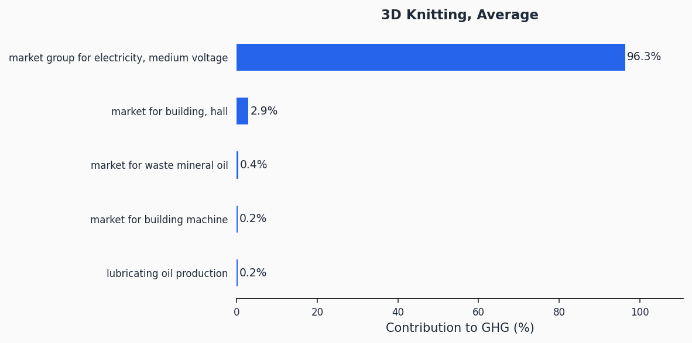
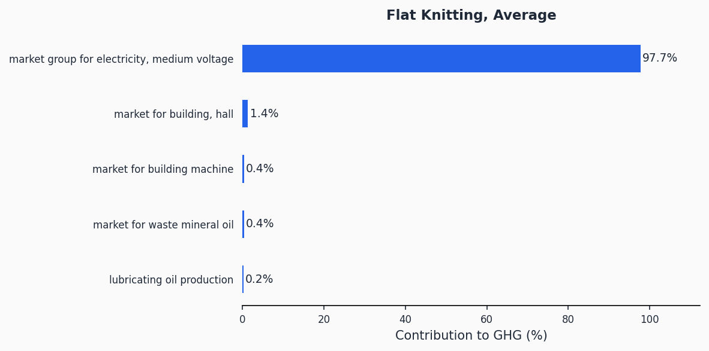
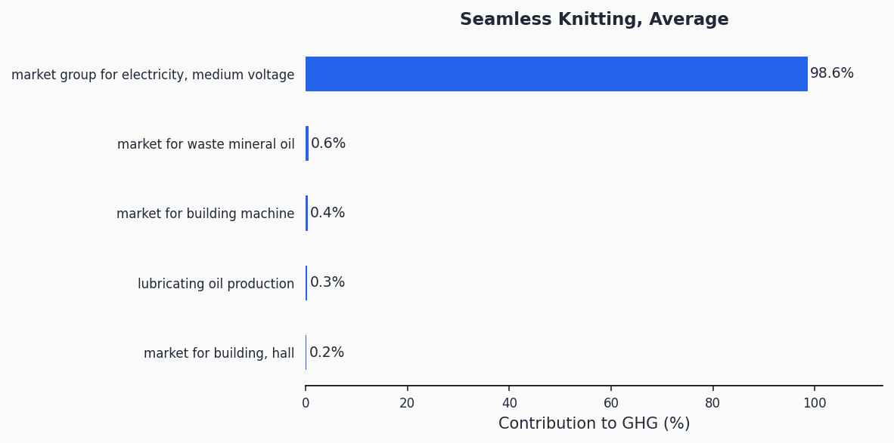
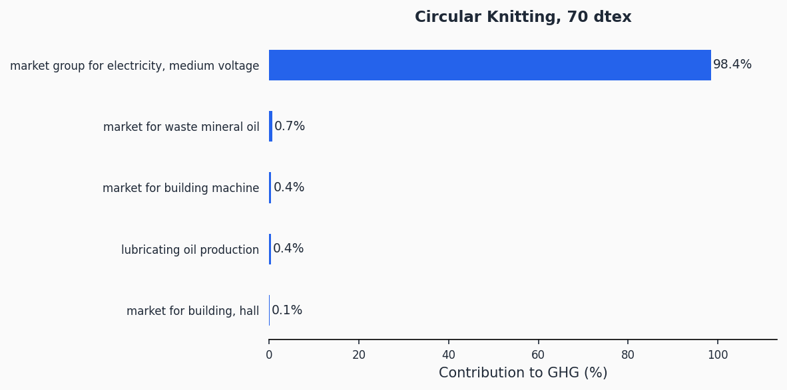
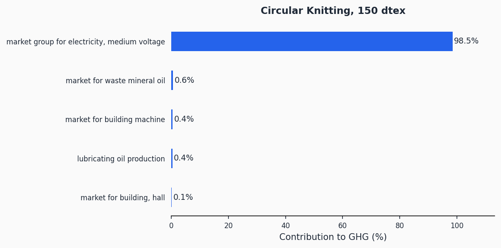
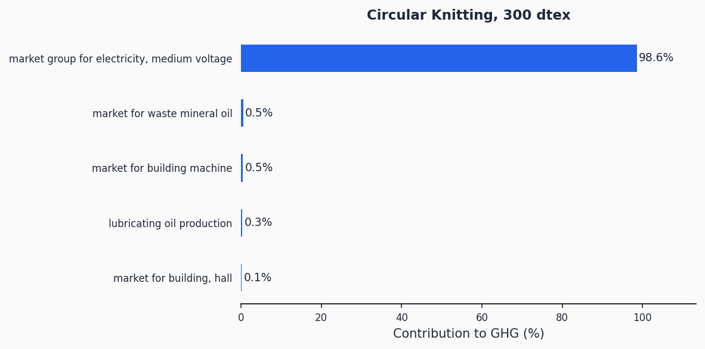

# Knitting

> Lifecycle assessment datasets for fabric formation by knitting across five machine technologies and multiple yarn gauges.

**13 datasets** | Functional unit: 1 kg fabric | All 16 EF 3.1 impact indicators

## Overview

This process category covers knitting -- the interlocking of yarn loops to form fabric. Knitting is a major fabric formation route in the textile industry, used for everything from fine hosiery to heavy outerwear. The system boundary includes electricity consumption, machine infrastructure (building and equipment), and lubricating oil inputs required to convert yarn into greige (unfinished) fabric.

The datasets span five distinct knitting technologies: flat knitting, circular knitting (at nine different yarn linear densities from 45 to 370 dtex), seamless knitting, hosiery knitting, and 3D knitting. For circular knitting, separate datasets capture the significant effect of yarn fineness on electricity demand -- finer yarns require more energy per kilogram of fabric produced.

Across all datasets, electricity consumption is the dominant driver of GHG impact, accounting for 96-99% of the total. This means that the electricity grid mix at the knitting location is the single most important parameter for these processes.

## Impact Scores (GHG)

| Dataset | GHG (kgCO2eq/kg) |
|---------|-------------------|
| Flat Knitting, Average | 3.97 |
| Circular Knitting, 170 dtex | 3.26 |
| Hosiery Knitting, Average | 3.96 |
| 3D Knitting, Average | 6.59 |
| Circular Knitting, 45 dtex | 3.69 |
| Circular Knitting, 70 dtex | 3.48 |
| Circular Knitting, 120 dtex | 3.33 |
| Circular Knitting, 200 dtex | 3.24 |
| Circular Knitting, 150 dtex | 3.29 |
| Seamless Knitting, Average | 4.14 |
| Circular Knitting, 370 dtex | 3.19 |
| Circular Knitting, 330 dtex | 3.19 |
| Circular Knitting, 300 dtex | 3.20 |

> Full impact scores across all 16 indicators: [impact-scores.csv](impact-scores.csv)

## Contribution Analysis

For each dataset, the chart below shows the top contributors to the GHG impact.

### 3D Knitting, Average

### Flat Knitting, Average

### Hosiery Knitting, Average

### Seamless Knitting, Average

### Circular Knitting, 45 dtex

### Circular Knitting, 70 dtex

### Circular Knitting, 120 dtex

### Circular Knitting, 150 dtex

### Circular Knitting, 170 dtex

### Circular Knitting, 200 dtex

### Circular Knitting, 300 dtex

### Circular Knitting, 330 dtex

### Circular Knitting, 370 dtex

## Technologies Covered

- **Flat knitting** -- Weft knitting on a flat-bed machine, used for shaped panels (sweaters, scarves)
- **Circular knitting** -- Weft knitting on a circular machine, the workhorse of jersey and interlock fabrics. Nine dtex variants (45, 70, 120, 150, 170, 200, 300, 330, 370) capture gauge-dependent energy differences
- **Seamless knitting** -- Circular knitting producing complete garment shapes without side seams
- **Hosiery knitting** -- Specialized small-diameter circular knitting for socks and tights
- **3D knitting** -- Additive-style knitting producing near-net-shape 3D structures with minimal waste

## Methodology

The datasets model electricity consumption, machine infrastructure amortization, and lubricating oil use at the knitting step. Electricity is by far the dominant input. The functional unit is 1 kg of greige knitted fabric. Background data comes from ecoinvent 3.12 (Cut-Off system model) and impact assessment uses the EF 3.1 characterization method.

Detailed methodology documentation: [methodology/](methodology/)

## Data Quality

| Dataset | P | TiR | TeR | GR |
|---------|---|-----|-----|----|
| Flat Knitting, Average | 2.02 | 2.02 | 2.02 | 3.0 |
| Circular Knitting, 170 dtex | 2.01 | 2.01 | 2.01 | 3.0 |
| Hosiery Knitting, Average | 2.02 | 2.02 | 2.02 | 3.0 |
| 3D Knitting, Average | 2.04 | 2.04 | 2.04 | 3.0 |
| Circular Knitting, 45 dtex | 2.01 | 2.01 | 2.01 | 3.0 |
| Circular Knitting, 70 dtex | 2.02 | 2.02 | 2.02 | 3.0 |
| Circular Knitting, 120 dtex | 2.02 | 2.02 | 2.02 | 3.0 |
| Circular Knitting, 200 dtex | 2.01 | 2.01 | 2.01 | 3.0 |
| Circular Knitting, 150 dtex | 2.02 | 2.02 | 2.02 | 3.0 |
| Seamless Knitting, Average | 2.01 | 2.01 | 2.01 | 3.0 |
| Circular Knitting, 370 dtex | 2.01 | 2.01 | 2.01 | 3.0 |
| Circular Knitting, 330 dtex | 2.01 | 2.01 | 2.01 | 3.0 |
| Circular Knitting, 300 dtex | 2.01 | 2.01 | 2.01 | 3.0 |

## Data Files

| File | Description |
|------|-------------|
| [impact-scores.csv](impact-scores.csv) | LCIA results for 16 EF 3.1 indicators |
| [ghg-contributions.csv](ghg-contributions.csv) | Per-exchange GHG contribution analysis |
| [process-steps.json](process-steps.json) | Machine-readable emission factor format |
| [inventory-brightway.xlsx](inventory-brightway.xlsx) | Brightway/Activity Browser compatible inventory |
