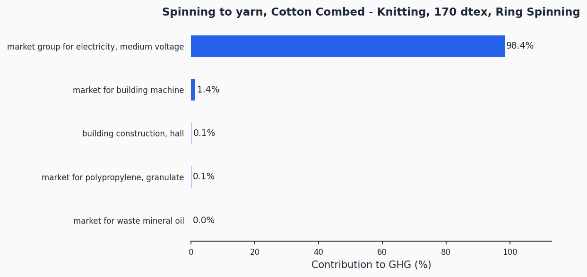
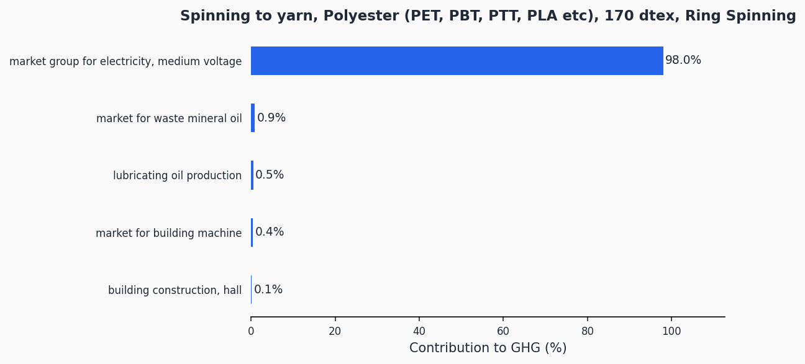
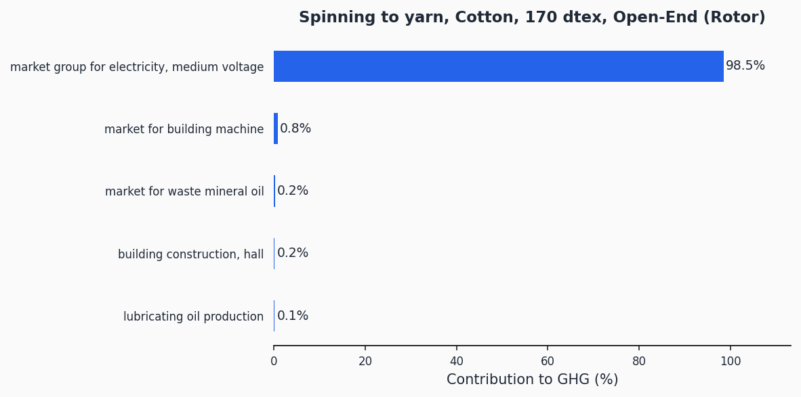
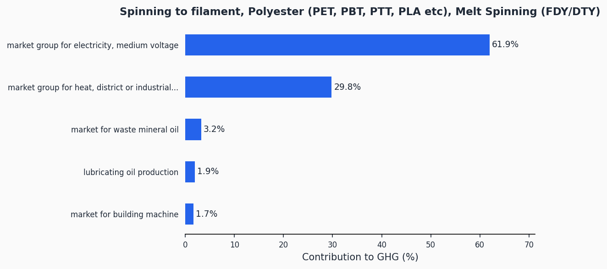
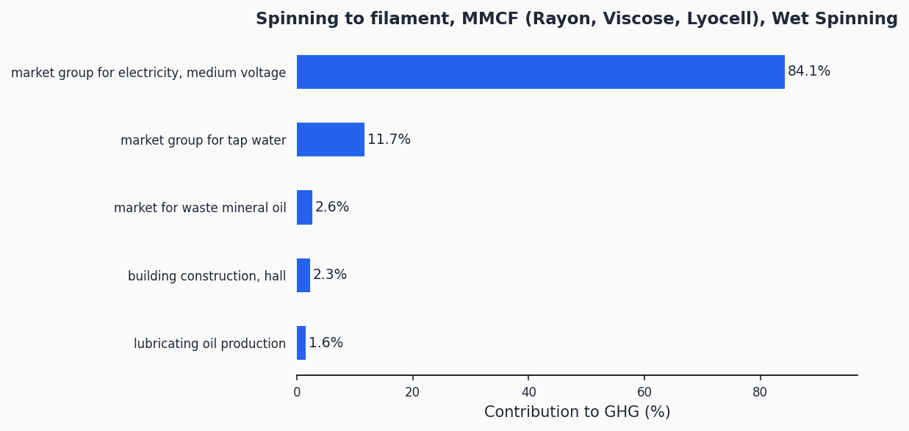

# Spinning

> Lifecycle assessment datasets for yarn and filament production across ring spinning, open-end rotor, and filament spinning technologies for all major fibre types.

**159 datasets** | Functional unit: 1 kg yarn | All 16 EF 3.1 impact indicators

## Process Categories

| Technology | Datasets | Fibre Families | Description |
|------------|----------|---------------|-------------|
| [Ring Spinning](ring-spinning.md) | 90 | 10 | Dominant staple yarn method. High-quality yarns for knitting and weaving. Higher energy per kg but finer, stronger yarns. |
| [Open-End Rotor](open-end-rotor.md) | 54 | 6 | Faster, more energy-efficient alternative. Bulkier yarns for casual knit and woven fabrics. |
| [Filament Spinning](filament-spinning.md) | 15 | 8 | Melt, wet, and dry spinning of continuous filaments. Lower energy intensity per kg. |

## Fibre Types

| Fibre Family | Ring Spinning | Open-End Rotor | Filament |
|-------------|:---:|:---:|:---:|
| Cotton (carded) | | ✓ | |
| Cotton Combed -- Knitting | ✓ | | |
| Cotton Combed -- Weaving | ✓ | | |
| Polyester (PET, PBT, PTT, PLA) | ✓ | ✓ | ✓ |
| Polyamide (Nylon 6, 6.6, PA 11, 12) | ✓ | ✓ | ✓ |
| Acrylic / Modacrylic / PAN | ✓ | ✓ | ✓ |
| MMCF (Rayon, Viscose, Lyocell) | ✓ | ✓ | ✓ |
| Elastane (Spandex/Lycra) | ✓ | | ✓ |
| Wool -- Woollen | ✓ | | |
| Wool -- Worsted | ✓ | | |
| Spun Silk | ✓ | ✓ | |
| Acetate / Triacetate | | | ✓ |
| Microfibers | | | ✓ |

## GHG Contribution Analysis

The charts below show GHG contributors for a representative subset of datasets. Contribution charts for all 159 datasets are in the [charts/](charts/) folder.

### Ring Spinning -- Cotton Combed (Knitting), 170 dtex

### Ring Spinning -- Polyester, 170 dtex

### Open-End Rotor -- Cotton, 170 dtex

### Filament -- Polyester, Melt Spinning (FDY/DTY)

### Filament -- MMCF, Wet Spinning

> Contribution charts for all 159 datasets are in the [charts/](charts/) folder.

## Methodology

The datasets model electricity consumption, machine infrastructure amortisation, and lubricating oil use at the spinning step. Electricity is the dominant input across all technologies. Background data comes from ecoinvent 3.12 (Cut-Off system model) and impact assessment uses the EF 3.1 characterisation method.

Detailed methodology documentation: [methodology/](methodology/)

## Data Quality

Due to the large number of datasets (159), the full DQR table is available in [impact-scores.csv](impact-scores.csv). DQR scores range as follows:

| Dimension | Range |
|-----------|-------|
| P (Precision) | 2.00 -- 2.48 |
| TiR (Time representativeness) | 2.00 -- 2.22 |
| TeR (Technological representativeness) | 2.00 -- 2.48 |
| GR (Geographical representativeness) | 3.0 |

All datasets achieve an overall DQR well below 3.0, qualifying as high quality under PEF guidelines.

## Data Files

| File | Description |
|------|-------------|
| [impact-scores.csv](impact-scores.csv) | LCIA results for 16 EF 3.1 indicators + DQR scores |
| [ghg-contributions.csv](ghg-contributions.csv) | Per-exchange GHG contribution analysis |
| [process-steps.json](process-steps.json) | Machine-readable emission factor format |
| [inventory-brightway.xlsx](inventory-brightway.xlsx) | Brightway/Activity Browser compatible inventory |
