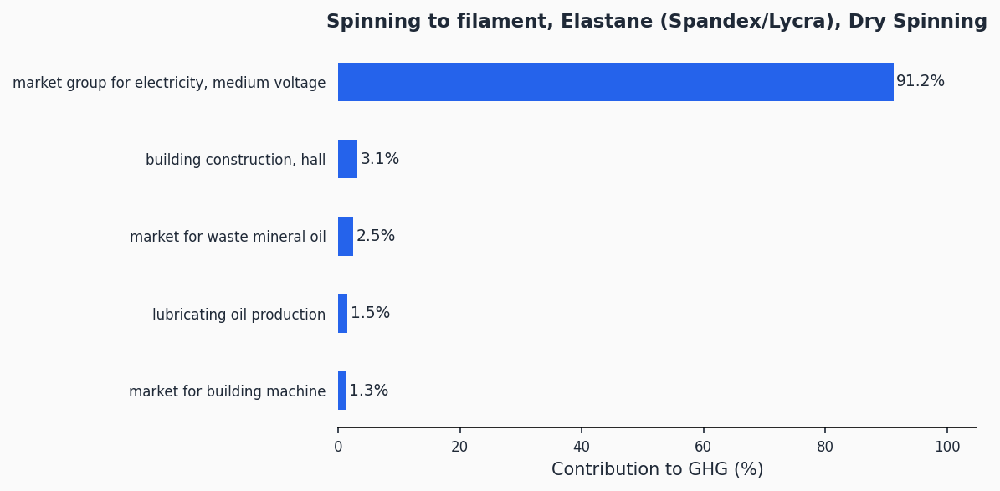
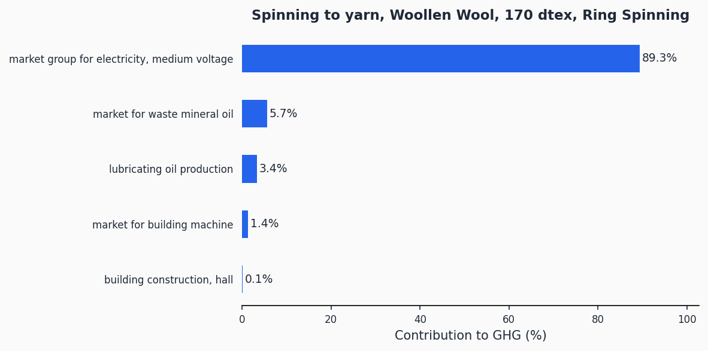
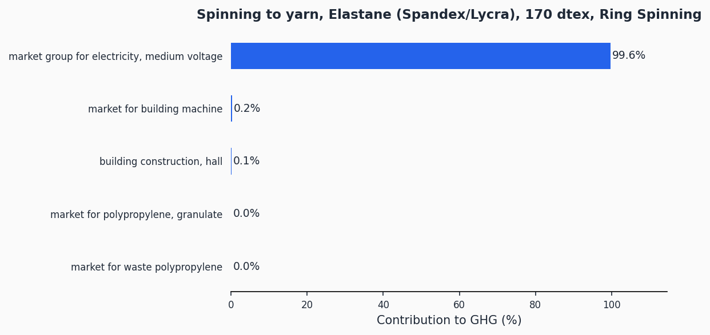

# Spinning

> Lifecycle assessment datasets for yarn and filament production across ring spinning, open-end rotor, melt spinning, wet spinning, and dry spinning technologies for all major fiber types.

**159 datasets** | Functional unit: 1 kg yarn | All 16 EF 3.1 impact indicators

## Overview

This process category covers spinning -- the conversion of staple fibers into spun yarn, or the extrusion of polymer melts/solutions into continuous filaments. Spinning is a fundamental step in textile manufacturing, determining yarn properties (strength, hairiness, evenness) that propagate through all downstream processes. The system boundary includes electricity consumption, machine infrastructure, and lubricating oil inputs required to produce yarn or filament from prepared fiber or polymer feedstock.

The datasets span three main spinning technology families: **ring spinning** (the dominant staple yarn production method), **open-end rotor spinning** (a faster, lower-energy alternative for coarser staple yarns), and **melt/wet/dry spinning** (for continuous filament production). Staple yarn datasets cover nine different yarn linear densities (45 to 370 dtex) across ten fiber families: cotton, cotton combed (knitting and weaving grades), MMCF (viscose, lyocell), polyester, polyamide, acrylic, elastane, wool (woollen and worsted), and spun silk. Filament datasets cover polyester, polyamide, acrylic, elastane, acetate, microfiber, MMCF, and generic polymer extrusion.

Yarn fineness is the dominant factor driving GHG impact within each fiber-technology combination -- finer yarns (lower dtex) require substantially more energy per kilogram. For example, 45 dtex ring-spun polyester yarn emits 16.76 kgCO2eq/kg while 370 dtex emits only 1.51 kgCO2eq/kg. Filament spinning processes are generally less energy-intensive than staple yarn spinning.

## Impact Scores (GHG)

### Filament Spinning

| Dataset | GHG (kgCO2eq/kg) |
|---------|-------------------|
| Spinning to filament, Acetate, Triacetate, Melt Spinning (POY) | 0.45 |
| Spinning to filament, Polyester (PET, PBT, PTT, PLA etc), Melt Spinning (POY) | 0.54 |
| Spinning to filament, Microfibers, Melt Spinning (POY) | 0.54 |
| Spinning to filament, Polyamides (Nylon 6, Nylon 6.6, PA 11, PA 12,...), Melt Spinning (POY) | 0.61 |
| Spinning to filament, Acrylic, Modacrylic, PAN (Polyacrylonitrile), Melt Spinning (POY) | 0.62 |
| Spinning to filament, Elastane (Spandex/Lycra), Melt Spinning (POY) | 0.70 |
| Spinning to filament, Acetate, Triacetate, Melt Spinning (FDY/DTY) | 0.72 |
| Spinning to filament, Microfibers, Melt Spinning (FDY/DTY) | 0.89 |
| Spinning to filament, Polyester (PET, PBT, PTT, PLA etc), Melt Spinning (FDY/DTY) | 0.89 |
| Spinning to filament, Extruder Polymer Filaments, Dry Spinning | 1.00 |
| Spinning to filament, Polyamides (Nylon 6, Nylon 6.6, PA 11, PA 12,...), Melt Spinning (FDY/DTY) | 1.00 |
| Spinning to filament, Acrylic, Modacrylic, PAN (Polyacrylonitrile), Melt Spinning (FDY/DTY) | 1.02 |
| Spinning to filament, MMCF (Rayon, Viscose, Lyocell), Wet Spinning | 1.08 |
| Spinning to filament, Elastane (Spandex/Lycra), Dry Spinning | 1.13 |
| Spinning to filament, Elastane (Spandex/Lycra), Melt Spinning (FDY/DTY) | 1.16 |

### Staple Yarn -- Cotton (Open-End Rotor)

| Dataset | GHG (kgCO2eq/kg) |
|---------|-------------------|
| Spinning to yarn, Cotton, 45 dtex, Open-End (Rotor) | 7.32 |
| Spinning to yarn, Cotton, 70 dtex, Open-End (Rotor) | 4.89 |
| Spinning to yarn, Cotton, 120 dtex, Open-End (Rotor) | 2.68 |
| Spinning to yarn, Cotton, 150 dtex, Open-End (Rotor) | 2.00 |
| Spinning to yarn, Cotton, 170 dtex, Open-End (Rotor) | 1.75 |
| Spinning to yarn, Cotton, 200 dtex, Open-End (Rotor) | 1.51 |
| Spinning to yarn, Cotton, 300 dtex, Open-End (Rotor) | 1.03 |
| Spinning to yarn, Cotton, 330 dtex, Open-End (Rotor) | 0.91 |
| Spinning to yarn, Cotton, 370 dtex, Open-End (Rotor) | 0.81 |

### Staple Yarn -- Cotton Combed, Knitting (Ring Spinning)

| Dataset | GHG (kgCO2eq/kg) |
|---------|-------------------|
| Spinning to yarn, Cotton Combed - Knitting, 45 dtex, Ring Spinning | 13.04 |
| Spinning to yarn, Cotton Combed - Knitting, 70 dtex, Ring Spinning | 7.90 |
| Spinning to yarn, Cotton Combed - Knitting, 120 dtex, Ring Spinning | 4.31 |
| Spinning to yarn, Cotton Combed - Knitting, 150 dtex, Ring Spinning | 3.36 |
| Spinning to yarn, Cotton Combed - Knitting, 170 dtex, Ring Spinning | 2.93 |
| Spinning to yarn, Cotton Combed - Knitting, 200 dtex, Ring Spinning | 2.45 |
| Spinning to yarn, Cotton Combed - Knitting, 300 dtex, Ring Spinning | 1.58 |
| Spinning to yarn, Cotton Combed - Knitting, 330 dtex, Ring Spinning | 1.43 |
| Spinning to yarn, Cotton Combed - Knitting, 370 dtex, Ring Spinning | 1.26 |

### Staple Yarn -- Cotton Combed, Weaving (Ring Spinning)

| Dataset | GHG (kgCO2eq/kg) |
|---------|-------------------|
| Spinning to yarn, Coton Combed - Weaving, 45 dtex, Ring Spinning | 14.68 |
| Spinning to yarn, Coton Combed - Weaving, 70 dtex, Ring Spinning | 8.78 |
| Spinning to yarn, Coton Combed - Weaving, 120 dtex, Ring Spinning | 4.73 |
| Spinning to yarn, Coton Combed - Weaving, 150 dtex, Ring Spinning | 3.67 |
| Spinning to yarn, Coton Combed - Weaving, 170 dtex, Ring Spinning | 3.18 |
| Spinning to yarn, Coton Combed - Weaving, 200 dtex, Ring Spinning | 2.65 |
| Spinning to yarn, Coton Combed - Weaving, 300 dtex, Ring Spinning | 1.69 |
| Spinning to yarn, Coton Combed - Weaving, 330 dtex, Ring Spinning | 1.52 |
| Spinning to yarn, Coton Combed - Weaving, 370 dtex, Ring Spinning | 1.34 |

### Staple Yarn -- Polyester (PET, PBT, PTT, PLA etc)

| Dataset | GHG (kgCO2eq/kg) |
|---------|-------------------|
| Spinning to yarn, Polyester, 45 dtex, Ring Spinning | 16.76 |
| Spinning to yarn, Polyester, 70 dtex, Ring Spinning | 9.74 |
| Spinning to yarn, Polyester, 120 dtex, Ring Spinning | 4.77 |
| Spinning to yarn, Polyester, 150 dtex, Ring Spinning | 3.75 |
| Spinning to yarn, Polyester, 170 dtex, Ring Spinning | 3.29 |
| Spinning to yarn, Polyester, 200 dtex, Ring Spinning | 2.79 |
| Spinning to yarn, Polyester, 300 dtex, Ring Spinning | 1.85 |
| Spinning to yarn, Polyester, 330 dtex, Ring Spinning | 1.68 |
| Spinning to yarn, Polyester, 370 dtex, Ring Spinning | 1.51 |
| Spinning to yarn, Polyester, 45 dtex, Open-End (Rotor) | 8.10 |
| Spinning to yarn, Polyester, 70 dtex, Open-End (Rotor) | 5.41 |
| Spinning to yarn, Polyester, 120 dtex, Open-End (Rotor) | 2.97 |
| Spinning to yarn, Polyester, 150 dtex, Open-End (Rotor) | 2.22 |
| Spinning to yarn, Polyester, 170 dtex, Open-End (Rotor) | 1.94 |
| Spinning to yarn, Polyester, 200 dtex, Open-End (Rotor) | 1.67 |
| Spinning to yarn, Polyester, 300 dtex, Open-End (Rotor) | 1.15 |
| Spinning to yarn, Polyester, 330 dtex, Open-End (Rotor) | 1.01 |
| Spinning to yarn, Polyester, 370 dtex, Open-End (Rotor) | 0.91 |

### Staple Yarn -- Polyamides (Nylon)

| Dataset | GHG (kgCO2eq/kg) |
|---------|-------------------|
| Spinning to yarn, Polyamides, 45 dtex, Ring Spinning | 21.99 |
| Spinning to yarn, Polyamides, 70 dtex, Ring Spinning | 12.74 |
| Spinning to yarn, Polyamides, 120 dtex, Ring Spinning | 6.21 |
| Spinning to yarn, Polyamides, 150 dtex, Ring Spinning | 4.87 |
| Spinning to yarn, Polyamides, 170 dtex, Ring Spinning | 4.27 |
| Spinning to yarn, Polyamides, 200 dtex, Ring Spinning | 3.60 |
| Spinning to yarn, Polyamides, 300 dtex, Ring Spinning | 2.37 |
| Spinning to yarn, Polyamides, 330 dtex, Ring Spinning | 2.15 |
| Spinning to yarn, Polyamides, 370 dtex, Ring Spinning | 1.91 |
| Spinning to yarn, Polyamides, 45 dtex, Open-End (Rotor) | 10.56 |
| Spinning to yarn, Polyamides, 70 dtex, Open-End (Rotor) | 7.05 |
| Spinning to yarn, Polyamides, 120 dtex, Open-End (Rotor) | 3.86 |
| Spinning to yarn, Polyamides, 150 dtex, Open-End (Rotor) | 2.88 |
| Spinning to yarn, Polyamides, 170 dtex, Open-End (Rotor) | 2.53 |
| Spinning to yarn, Polyamides, 200 dtex, Open-End (Rotor) | 2.18 |
| Spinning to yarn, Polyamides, 300 dtex, Open-End (Rotor) | 1.49 |
| Spinning to yarn, Polyamides, 330 dtex, Open-End (Rotor) | 1.32 |
| Spinning to yarn, Polyamides, 370 dtex, Open-End (Rotor) | 1.18 |

### Staple Yarn -- Acrylic / PAN

| Dataset | GHG (kgCO2eq/kg) |
|---------|-------------------|
| Spinning to yarn, Acrylic/PAN, 45 dtex, Ring Spinning | 23.01 |
| Spinning to yarn, Acrylic/PAN, 70 dtex, Ring Spinning | 13.36 |
| Spinning to yarn, Acrylic/PAN, 120 dtex, Ring Spinning | 6.51 |
| Spinning to yarn, Acrylic/PAN, 150 dtex, Ring Spinning | 5.12 |
| Spinning to yarn, Acrylic/PAN, 170 dtex, Ring Spinning | 4.48 |
| Spinning to yarn, Acrylic/PAN, 200 dtex, Ring Spinning | 3.78 |
| Spinning to yarn, Acrylic/PAN, 300 dtex, Ring Spinning | 2.50 |
| Spinning to yarn, Acrylic/PAN, 330 dtex, Ring Spinning | 2.27 |
| Spinning to yarn, Acrylic/PAN, 370 dtex, Ring Spinning | 2.02 |
| Spinning to yarn, Acrylic/PAN, 45 dtex, Open-End (Rotor) | 9.71 |
| Spinning to yarn, Acrylic/PAN, 70 dtex, Open-End (Rotor) | 6.49 |
| Spinning to yarn, Acrylic/PAN, 120 dtex, Open-End (Rotor) | 3.55 |
| Spinning to yarn, Acrylic/PAN, 150 dtex, Open-End (Rotor) | 2.65 |
| Spinning to yarn, Acrylic/PAN, 170 dtex, Open-End (Rotor) | 2.33 |
| Spinning to yarn, Acrylic/PAN, 200 dtex, Open-End (Rotor) | 2.00 |
| Spinning to yarn, Acrylic/PAN, 300 dtex, Open-End (Rotor) | 1.37 |
| Spinning to yarn, Acrylic/PAN, 330 dtex, Open-End (Rotor) | 1.21 |
| Spinning to yarn, Acrylic/PAN, 370 dtex, Open-End (Rotor) | 1.08 |

### Staple Yarn -- MMCF (Rayon, Viscose, Lyocell)

| Dataset | GHG (kgCO2eq/kg) |
|---------|-------------------|
| Spinning to yarn, MMCF, 45 dtex, Ring Spinning | 23.45 |
| Spinning to yarn, MMCF, 70 dtex, Ring Spinning | 13.59 |
| Spinning to yarn, MMCF, 120 dtex, Ring Spinning | 6.62 |
| Spinning to yarn, MMCF, 150 dtex, Ring Spinning | 5.20 |
| Spinning to yarn, MMCF, 170 dtex, Ring Spinning | 4.55 |
| Spinning to yarn, MMCF, 200 dtex, Ring Spinning | 3.84 |
| Spinning to yarn, MMCF, 300 dtex, Ring Spinning | 2.53 |
| Spinning to yarn, MMCF, 330 dtex, Ring Spinning | 2.30 |
| Spinning to yarn, MMCF, 370 dtex, Ring Spinning | 2.05 |
| Spinning to yarn, MMCF, 45 dtex, Open-End (Rotor) | 8.94 |
| Spinning to yarn, MMCF, 70 dtex, Open-End (Rotor) | 5.97 |
| Spinning to yarn, MMCF, 120 dtex, Open-End (Rotor) | 3.27 |
| Spinning to yarn, MMCF, 150 dtex, Open-End (Rotor) | 2.44 |
| Spinning to yarn, MMCF, 170 dtex, Open-End (Rotor) | 2.14 |
| Spinning to yarn, MMCF, 200 dtex, Open-End (Rotor) | 1.84 |
| Spinning to yarn, MMCF, 300 dtex, Open-End (Rotor) | 1.26 |
| Spinning to yarn, MMCF, 330 dtex, Open-End (Rotor) | 1.11 |
| Spinning to yarn, MMCF, 370 dtex, Open-End (Rotor) | 1.00 |

### Staple Yarn -- Elastane (Spandex/Lycra)

| Dataset | GHG (kgCO2eq/kg) |
|---------|-------------------|
| Spinning to yarn, Elastane, 45 dtex, Ring Spinning | 31.36 |
| Spinning to yarn, Elastane, 70 dtex, Ring Spinning | 18.17 |
| Spinning to yarn, Elastane, 120 dtex, Ring Spinning | 8.84 |
| Spinning to yarn, Elastane, 150 dtex, Ring Spinning | 6.94 |
| Spinning to yarn, Elastane, 170 dtex, Ring Spinning | 6.08 |
| Spinning to yarn, Elastane, 200 dtex, Ring Spinning | 5.13 |
| Spinning to yarn, Elastane, 300 dtex, Ring Spinning | 3.38 |
| Spinning to yarn, Elastane, 330 dtex, Ring Spinning | 3.07 |
| Spinning to yarn, Elastane, 370 dtex, Ring Spinning | 2.73 |

### Staple Yarn -- Wool (Woollen)

| Dataset | GHG (kgCO2eq/kg) |
|---------|-------------------|
| Spinning to yarn, Woollen Wool, 45 dtex, Ring Spinning | 13.49 |
| Spinning to yarn, Woollen Wool, 70 dtex, Ring Spinning | 7.94 |
| Spinning to yarn, Woollen Wool, 120 dtex, Ring Spinning | 4.02 |
| Spinning to yarn, Woollen Wool, 150 dtex, Ring Spinning | 3.22 |
| Spinning to yarn, Woollen Wool, 170 dtex, Ring Spinning | 2.85 |
| Spinning to yarn, Woollen Wool, 200 dtex, Ring Spinning | 2.45 |
| Spinning to yarn, Woollen Wool, 300 dtex, Ring Spinning | 1.72 |
| Spinning to yarn, Woollen Wool, 330 dtex, Ring Spinning | 1.58 |
| Spinning to yarn, Woollen Wool, 370 dtex, Ring Spinning | 1.44 |

### Staple Yarn -- Wool (Worsted)

| Dataset | GHG (kgCO2eq/kg) |
|---------|-------------------|
| Spinning to yarn, Worsted Wool, 45 dtex, Ring Spinning | 16.74 |
| Spinning to yarn, Worsted Wool, 70 dtex, Ring Spinning | 9.84 |
| Spinning to yarn, Worsted Wool, 120 dtex, Ring Spinning | 4.95 |
| Spinning to yarn, Worsted Wool, 150 dtex, Ring Spinning | 3.96 |
| Spinning to yarn, Worsted Wool, 170 dtex, Ring Spinning | 3.50 |
| Spinning to yarn, Worsted Wool, 200 dtex, Ring Spinning | 3.01 |
| Spinning to yarn, Worsted Wool, 300 dtex, Ring Spinning | 2.09 |
| Spinning to yarn, Worsted Wool, 330 dtex, Ring Spinning | 1.93 |
| Spinning to yarn, Worsted Wool, 370 dtex, Ring Spinning | 1.75 |

### Staple Yarn -- Spun Silk

| Dataset | GHG (kgCO2eq/kg) |
|---------|-------------------|
| Spinning to yarn, Spun Silk, 45 dtex, Ring Spinning | 26.23 |
| Spinning to yarn, Spun Silk, 70 dtex, Ring Spinning | 15.20 |
| Spinning to yarn, Spun Silk, 120 dtex, Ring Spinning | 7.40 |
| Spinning to yarn, Spun Silk, 150 dtex, Ring Spinning | 5.81 |
| Spinning to yarn, Spun Silk, 170 dtex, Ring Spinning | 5.09 |
| Spinning to yarn, Spun Silk, 200 dtex, Ring Spinning | 4.29 |
| Spinning to yarn, Spun Silk, 300 dtex, Ring Spinning | 2.83 |
| Spinning to yarn, Spun Silk, 330 dtex, Ring Spinning | 2.57 |
| Spinning to yarn, Spun Silk, 370 dtex, Ring Spinning | 2.28 |
| Spinning to yarn, Spun Silk, 45 dtex, Open-End (Rotor) | 11.31 |
| Spinning to yarn, Spun Silk, 70 dtex, Open-End (Rotor) | 7.55 |
| Spinning to yarn, Spun Silk, 120 dtex, Open-End (Rotor) | 4.14 |
| Spinning to yarn, Spun Silk, 150 dtex, Open-End (Rotor) | 3.08 |
| Spinning to yarn, Spun Silk, 170 dtex, Open-End (Rotor) | 2.70 |
| Spinning to yarn, Spun Silk, 200 dtex, Open-End (Rotor) | 2.32 |
| Spinning to yarn, Spun Silk, 300 dtex, Open-End (Rotor) | 1.58 |
| Spinning to yarn, Spun Silk, 330 dtex, Open-End (Rotor) | 1.40 |
| Spinning to yarn, Spun Silk, 370 dtex, Open-End (Rotor) | 1.25 |

> Full impact scores across all 16 indicators: [impact-scores.csv](impact-scores.csv)

## Contribution Analysis

The charts below show the top GHG contributors for a representative subset of datasets -- one per technology and fiber family. Contribution charts for all 159 datasets are available in the [charts/](charts/) folder.

### Spinning to filament, Polyester, Melt Spinning (FDY/DTY)

### Spinning to filament, Elastane, Dry Spinning

### Spinning to filament, MMCF, Wet Spinning

### Spinning to yarn, Cotton, 170 dtex, Open-End (Rotor)

### Spinning to yarn, Cotton Combed - Knitting, 170 dtex, Ring Spinning

### Spinning to yarn, Polyester, 170 dtex, Ring Spinning

### Spinning to yarn, Woollen Wool, 170 dtex, Ring Spinning

### Spinning to yarn, Elastane, 170 dtex, Ring Spinning

> Contribution charts for all 159 datasets are in the [charts/](charts/) folder.

## Technologies Covered

**Staple Yarn Spinning:**
- **Ring spinning** -- The most widely used staple yarn technology. Produces high-quality yarns suitable for both knitting and weaving. Higher energy consumption per kg than rotor spinning
- **Open-end rotor spinning** -- Faster and more energy-efficient than ring spinning. Produces bulkier yarns suited for casual knit and woven fabrics

**Filament Spinning:**
- **Melt spinning (POY)** -- Partially oriented yarn by melt extrusion. Lower energy than FDY/DTY
- **Melt spinning (FDY/DTY)** -- Fully drawn or draw-textured yarn by melt extrusion. Additional drawing and texturing steps increase energy demand
- **Wet spinning** -- Polymer dissolved in solvent, extruded into a coagulation bath. Used for MMCF (viscose, lyocell)
- **Dry spinning** -- Polymer dissolved in volatile solvent, extruded into hot air. Used for elastane and some specialty fibers

**Fiber Types:**
- Cotton (carded/open-end, combed for knitting, combed for weaving)
- Polyester (PET, PBT, PTT, PLA etc)
- Polyamides (Nylon 6, Nylon 6.6, PA 11, PA 12)
- Acrylic / Modacrylic / PAN
- MMCF (Rayon, Viscose, Lyocell)
- Elastane (Spandex/Lycra)
- Wool (Woollen and Worsted systems)
- Spun Silk
- Acetate / Triacetate
- Microfibers

## Methodology

The datasets model electricity consumption, machine infrastructure amortization, and lubricating oil use at the spinning step. Electricity is the dominant input across all technologies. The functional unit is 1 kg of yarn or filament. Background data comes from ecoinvent 3.12 (Cut-Off system model) and impact assessment uses the EF 3.1 characterization method.

Detailed methodology documentation: [methodology/](methodology/)

## Data Quality

Due to the large number of datasets (159), the full DQR table is available in [impact-scores.csv](impact-scores.csv). DQR scores across the spinning datasets range as follows:

| Dimension | Range |
|-----------|-------|
| P (Precision) | 2.00 -- 2.48 |
| TiR (Time representativeness) | 2.00 -- 2.22 |
| TeR (Technological representativeness) | 2.00 -- 2.48 |
| GR (Geographical representativeness) | 3.0 |

All datasets achieve an overall DQR well below 3.0, qualifying as high quality under PEF guidelines.

## Data Files

| File | Description |
|------|-------------|
| [impact-scores.csv](impact-scores.csv) | LCIA results for 16 EF 3.1 indicators |
| [ghg-contributions.csv](ghg-contributions.csv) | Per-exchange GHG contribution analysis |
| [process-steps.json](process-steps.json) | Machine-readable emission factor format |
| [inventory-brightway.xlsx](inventory-brightway.xlsx) | Brightway/Activity Browser compatible inventory |
