# Weaving

> Lifecycle assessment datasets for fabric formation by weaving across multiple loom technologies, yarn densities, and specialty substrates.

**16 datasets** | Functional unit: 1 kg fabric | All 16 EF 3.1 impact indicators

## Overview

This process category covers weaving -- the interlacing of warp and weft yarns on a loom to form fabric. Weaving is the dominant fabric formation method for structured textiles used in apparel (shirting, denim, suiting), home textiles, and technical applications. The system boundary includes electricity consumption, sizing inputs (for natural fiber warps), machine infrastructure, and lubricating oil.

The datasets span four main loom technologies: air jet (at eight yarn linear densities from 45 to 370 dtex), rapier, water jet, and shuttle (projectile). Additional specialty datasets cover jacquard weaving, silk weaving, carpet weaving, and primary backing weaving. For air-jet weaving, finer yarns demand substantially more energy per kilogram -- the 45 dtex dataset has roughly five times the GHG impact of the 370 dtex dataset.

Unlike knitting, weaving processes include a sizing step for natural fiber warps (starch application to improve weavability), which adds a non-trivial contribution to the total impact. Electricity remains the dominant driver (85-99% of GHG), but sizing can account for 9-13% of the total in mid-range dtex air-jet fabrics.

## Impact Scores (GHG)

| Dataset | GHG (kgCO2eq/kg) |
|---------|-------------------|
| Air jet, 45 dtex | 21.69 |
| Air jet, 70 dtex | 14.50 |
| Air jet, 120 dtex | 9.10 |
| Air jet, 150 dtex | 7.59 |
| Air jet, 170 dtex | 6.89 |
| Air jet, 200 dtex | 6.09 |
| Air jet, 300 dtex | 4.62 |
| Air jet, 330 dtex | 4.36 |
| Air jet, 370 dtex | 4.08 |
| Rapier | 8.59 |
| Water jet | 3.60 |
| Shuttle (Projectile) | 6.82 |
| Jacquard | 9.40 |
| Silk | 10.84 |
| Carpet | 5.90 |
| Primary backing | 1.49 |

> Full impact scores across all 16 indicators: [impact-scores.csv](impact-scores.csv)

## Contribution Analysis

For each dataset, the chart below shows the top contributors to the GHG impact.

### Air jet, 45 dtex
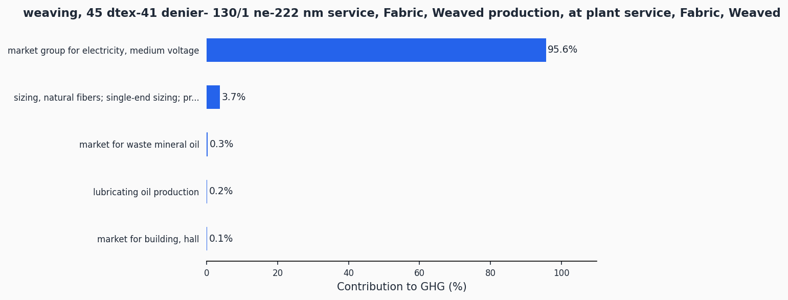

### Air jet, 70 dtex
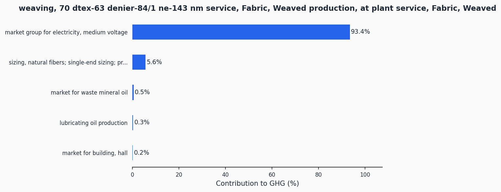

### Air jet, 120 dtex

### Air jet, 150 dtex
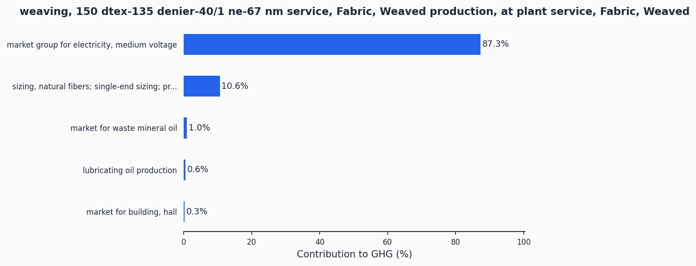

### Air jet, 170 dtex

### Air jet, 200 dtex
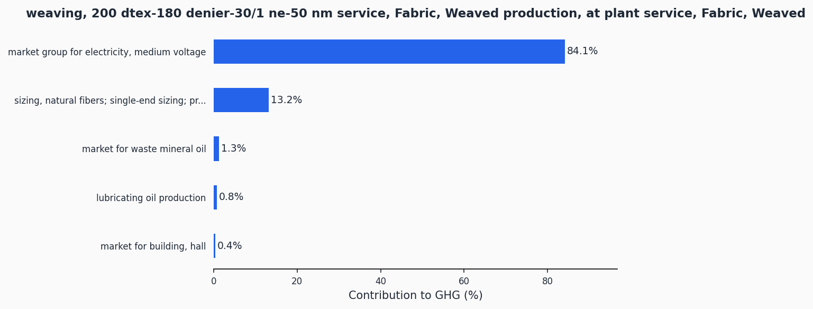

### Air jet, 300 dtex
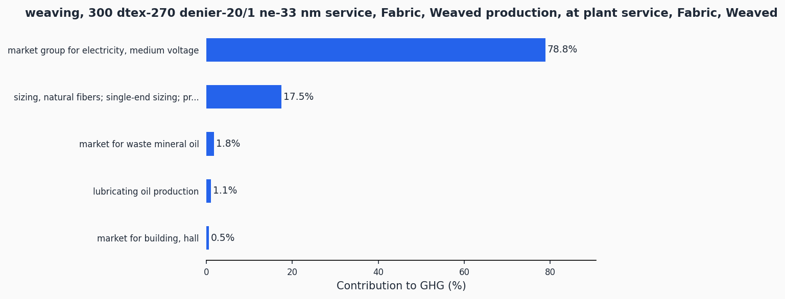

### Air jet, 330 dtex

### Air jet, 370 dtex
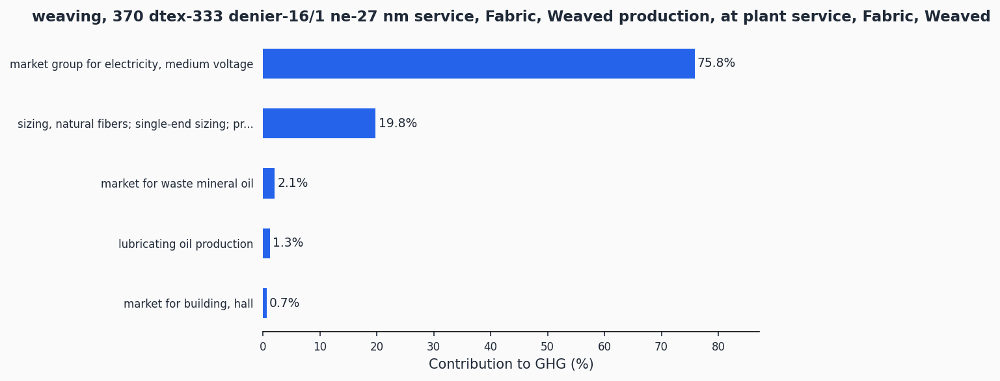

### Rapier
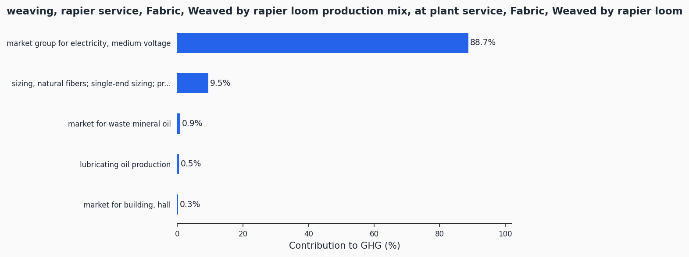

### Water jet
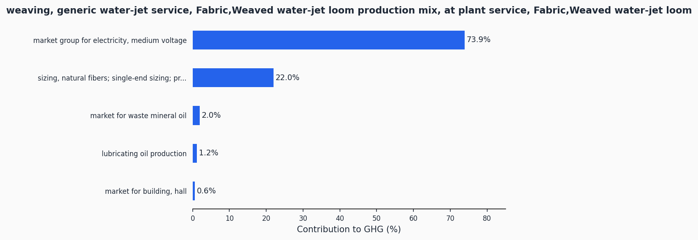

### Shuttle (Projectile)
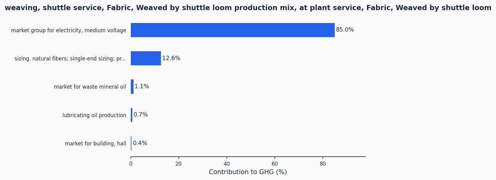

### Jacquard
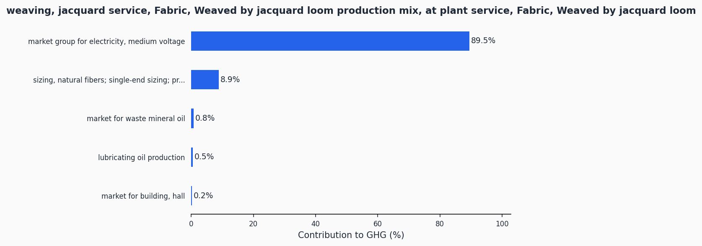

### Silk
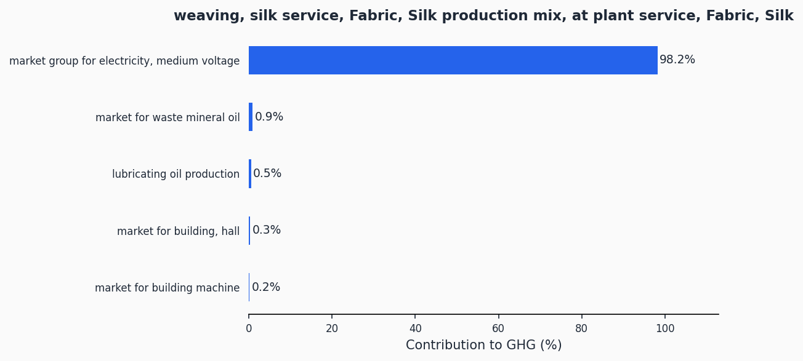

### Carpet
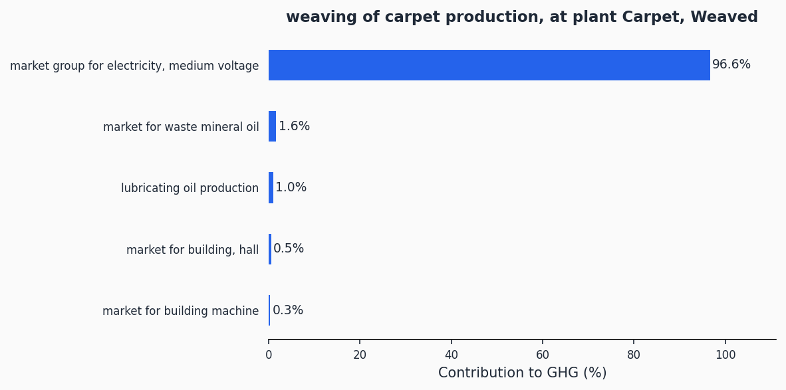

### Primary Backing
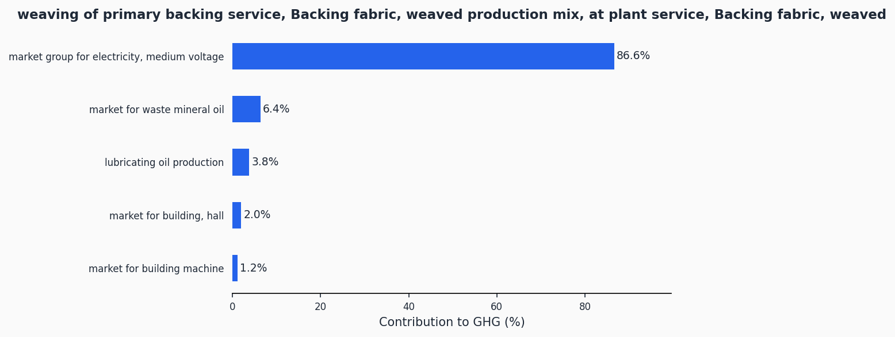

## Technologies Covered

- **Air jet** -- High-speed loom using compressed air to propel the weft. Most common for commodity fabrics. Eight dtex variants (45, 70, 120, 150, 170, 200, 300, 330, 370)
- **Rapier** -- Versatile loom using a mechanical arm to carry the weft. Suited for heavier and wider fabrics
- **Water jet** -- Loom using a jet of water to insert the weft. Efficient but limited to hydrophobic fibers
- **Shuttle (Projectile)** -- Traditional loom technology using a projectile or shuttle to carry the weft across the shed
- **Jacquard** -- Loom with individual warp thread control for complex patterned fabrics
- **Silk weaving** -- Specialized weaving for silk fabrics
- **Carpet weaving** -- Weaving process for carpet substrates
- **Backing weaving** -- Weaving of primary backing for carpet and other composite fabrics

## Methodology

The datasets model electricity consumption, warp sizing (for natural fiber air-jet processes), machine infrastructure amortization, and lubricating oil use. The functional unit is 1 kg of greige woven fabric. Background data comes from ecoinvent 3.12 (Cut-Off system model) and impact assessment uses the EF 3.1 characterization method.

Detailed methodology documentation: [methodology/](methodology/)

## Data Quality

| Dataset | P | TiR | TeR | GR |
|---------|---|-----|-----|----|
| Air jet, 330 dtex | 2.04 | 2.04 | 2.04 | 3.0 |
| Air jet, 45 dtex | 2.04 | 2.04 | 2.04 | 3.0 |
| Air jet, 70 dtex | 2.07 | 2.07 | 2.07 | 3.0 |
| Water jet | 2.04 | 2.04 | 2.04 | 3.0 |
| Air jet, 170 dtex | 2.14 | 2.14 | 2.14 | 3.0 |
| Shuttle (Projectile) | 2.15 | 2.15 | 2.15 | 3.0 |
| Air jet, 150 dtex | 2.13 | 2.13 | 2.13 | 3.0 |
| Jacquard | 2.11 | 2.11 | 2.11 | 3.0 |
| Air jet, 370 dtex | 2.04 | 2.04 | 2.04 | 3.0 |
| Carpet | 2.03 | 2.03 | 2.03 | 3.0 |
| Air jet, 120 dtex | 2.11 | 2.11 | 2.11 | 3.0 |
| Silk | 2.02 | 2.02 | 2.02 | 3.0 |
| Primary backing | 2.13 | 2.13 | 2.13 | 3.0 |
| Rapier | 2.11 | 2.11 | 2.11 | 3.0 |
| Air jet, 200 dtex | 2.16 | 2.16 | 2.16 | 3.0 |
| Air jet, 300 dtex | 2.04 | 2.04 | 2.04 | 3.0 |

## Data Files

| File | Description |
|------|-------------|
| [impact-scores.csv](impact-scores.csv) | LCIA results for 16 EF 3.1 indicators |
| [ghg-contributions.csv](ghg-contributions.csv) | Per-exchange GHG contribution analysis |
| [process-steps.json](process-steps.json) | Machine-readable emission factor format |
| [inventory-brightway.xlsx](inventory-brightway.xlsx) | Brightway/Activity Browser compatible inventory |
